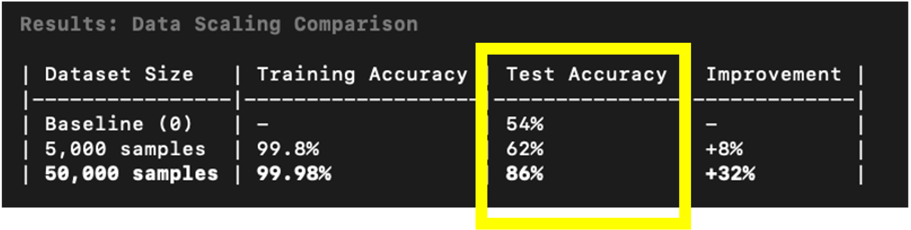
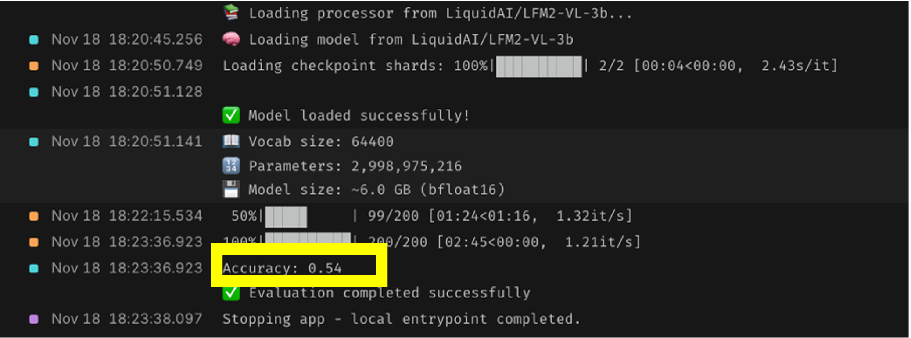
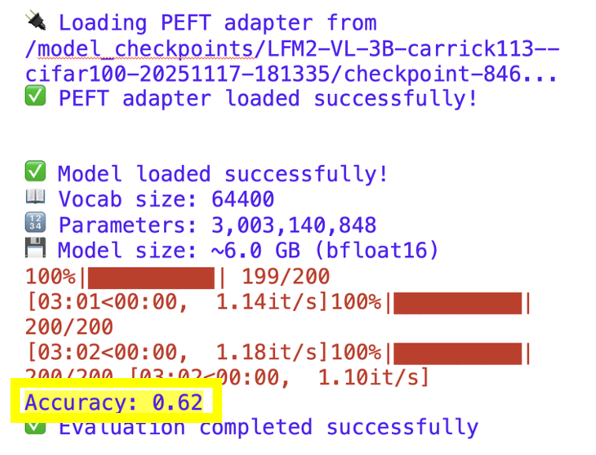
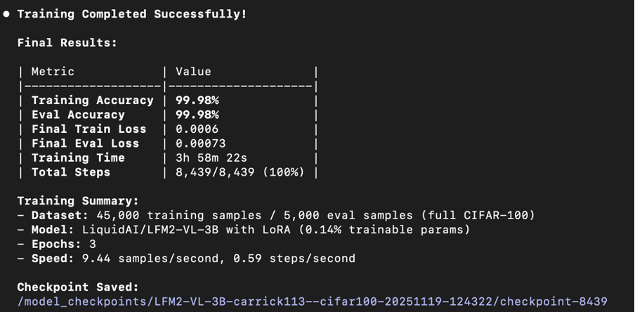
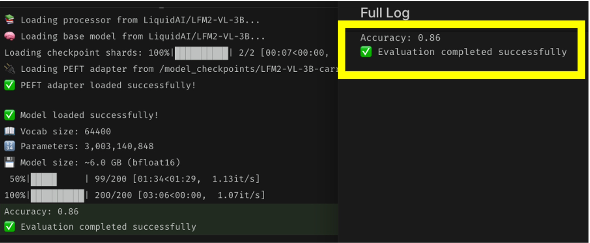

# Scaling Fine-Tuning: My Experiment with LiquidAI's 3B Vision Language Model 

 

I spent the weekend experimenting with LiquidAI's 3B Vision Model to see just how "smart" a small model could get with the right fine-tuning strategy. I leveraged Modal for compute and LoRA for parameter-efficient fine-tuning. I started with a 3B parameter vision model achieving 56% accuracy. Fine-tuned with LoRA on just 5,000 images—10% of available data. Then scaled to 50,000 samples. 

The question: where's the sweet spot between data efficiency and performance? 

The results surprised me. 📈🔥

---

### Baseline model

First, I tested LiquidAI's 3B vision model—3 billion parameters packed into 6GB! Out-of-the-box: 54% accuracy on CIFAR-100. Not bad for zero training! Now here's the fun part: fine-tuning with LoRA . Will tiny adjustments unlock major gains? Let's find out. 🎯🔥 

 

---

### Eval - Performance Comparison: Base vs Fine-tuned Model
 
LiquidAI's 3B vision model improved from 54% to 62% test accuracy after LoRA fine-tuning—an 8-point gain using just 4,500 training images and tuning only 0.14% of parameters These results are encouraging—we achieved 62% accuracy using only 10% of the available training data. Our next step is to train with the full dataset to unlock the model's full potential.

 

---

###  Fine-tuned full dataset

The model achieved near-perfect training accuracy (99.98%) on the full CIFAR-100 dataset with 50,000 images. The loss dropped from ~3.45 to 0.0006 over 3 epochs, showing excellent convergence. Now lets run evaluation on the held-out test set to measure true generalization performance. 

 

--- 

###  Evaluation 

The 86% test accuracy on unseen images is a solid result. 10x more data = 24% accuracy gain (62% → 86%). The jump from 5K to 50K samples delivered massive returns—far exceeding diminishing returns expectations. The model clearly benefits from seeing more examples of each class in this 100-category task.

 

--- 

### Future work

Future Work To bridge the gap between 99% training accuracy and 86% test accuracy:

Augmentation: Implementing aggressive image augmentations (MixUp/CutMix) to improve robustness.

Optimization: Tuning LoRA rank/alpha to squeeze out every bit of performance.

